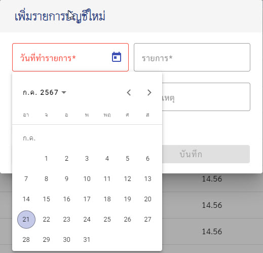
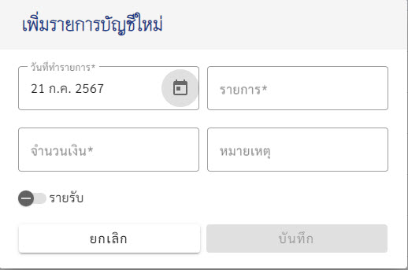
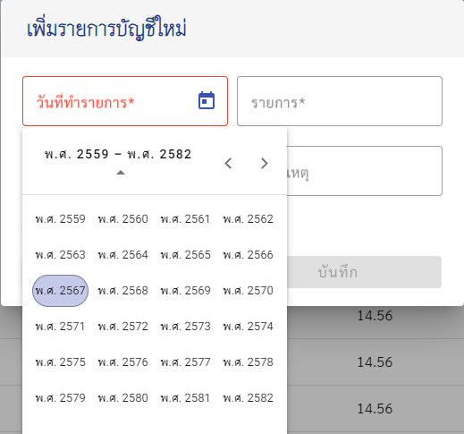
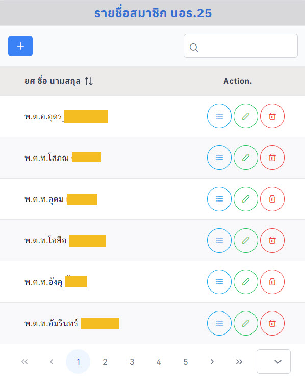

# Material-primeng-plimeflex-member

---
### อีกอันคือ AngPrimendTailwindLoginSingupFirebase (สะกดผิดนะจ๊ะ)

---

* เป็นการลองใช้ PrimeNg กับ Material
* ทำงานด้วยกันได้ โดยแยก component กัน หากอันใดใช้ Material ก็ต้องใช้เพียงอย่างเดียว
* คอมโปแนนท์ใหนใช้ PrimeNg ก็ต้องใช้เพียงอย่างเดียวเช่นกัน
* สำหรับ Primeflex PrimeIcons สามารถใช้ได้ทั้งโปรเจค ไม่มีปัญหาอะไร
* ที่ใช้แบบนี้ คือ PrimeNg ใช้งานง่ายและสวยงาม แต่ไม่สามารถใช้ Calendar ที่เป็นปี พ.ศ.ได้ ทำได้แค่ วันและเดือนเป็นภาษาไทยเท่านั้น ปียังเป็น ค.ศ. ไม่รู้วิธีแก้
* ส่วน Material ก็มีความสวยงามไม่แพ้กัน แต่การใช้งานค่อนข้างซับซ้อน เช่า ตาราง ต้องเซทหลายอย่างมาก จะเอาแต่ละฟิลด์ของข้อมูลมารวมกันไม่ได้
จะให้ sort paginator ก็ต้องกำหนดโน่นนี่นั่นมากมาย แต่ Prime ใช้แค่ [paginator]="true" ก็เรียบร้อย ข้อมูลที่จะนำมาแสดงก็แค่เอาตัวแปรข้อมูลมา [value]="members"
เช่น.-
```typescript

<p-table
#dt [value]="members"
dataKey="id"
  [rows]="6"
  [breakpoint]="'960px'"
  [rowsPerPageOptions]="[5, 10, 30]"
  [loading]="loading"
  [paginator]="true"
  [globalFilterFields]="['firstname', 'lastname']"
styleClass="p-datatable-striped"
  [tableStyle]="{ 'min-width': '20rem' }">

```

ต่อไปก็กำหนดค่า th td ตามรูปแบบตารางพื้นฐานทั่วไป ก็จะได้ตารางสวยๆ แล้ว ถ้า Prime สามารถทำให้เป็นปี พ.ศ.ได้ก็จะยอดเยี่ยมมากเลย







นี่คือความดีงามของ Angular Material Datepicker :)
ท้ายสุด คือตารางของ PrimeNg สวยงามใช้งานง่ายนะขอบอก



---

**_เพิ่มเติม_** แสดงโหลด และลืมพาสเวิร์ด ส่งอีเมล์รีเซทพาสเวิร์ด

---

### ปัญหาที่พบ

- ตอน build จะเกิดข้อผิดพลาด แก้ไขโดย.-

```typescript
ng build --allowed-common-js-dependencies *  --base-href  https://member-dc3a5.web.app  
```
- ในไฟล์ tsconfig
```html
ในไฟล์ tsconfig.json ตั้งค่า "allowSyntheticDefaultImports": true ในส่วนของ compilerOptions 
ค่านี้อนุญาตให้ใช้ default imports จาก CommonJS modules ได้
```
- ใน angular.json

```typescript
    .....
"architect": {
        "build": {
          "builder": "@angular-devkit/build-angular:application",
          "options": {
            "allowedCommonJsDependencies": [ // เพิ่มอันนี้
              "moment",
              "quill",
              "quill-delta"
            ], // ปิดตรงนี้นะ
            "outputPath": "dist",
            .....
```

- ถ้าตอน build ไม่ใส่ --base-href ... จะมีข้อความเตือนแบบนี้.-
```html
No Firebase app associated with site member-dc3a5, injecting project default config.
  You can link a Web app to a Hosting site here https://console.firebase.google.com/project/member-dc3a5/settings/general/web

```
- ต้องไม่ลืมใส่ --base-href ... (my url)
- error -> ponycode is deprecated.... ลงโปรแกรม nvm แล้วรัน
```html
nvm install 20.10.0
nvm use 20.10.0
```
- ดูเวอร์ชั่น node.js ที่เป็น LTS 
- thank a lot _copilot, stack overflow & angular.dev/tools_

---
